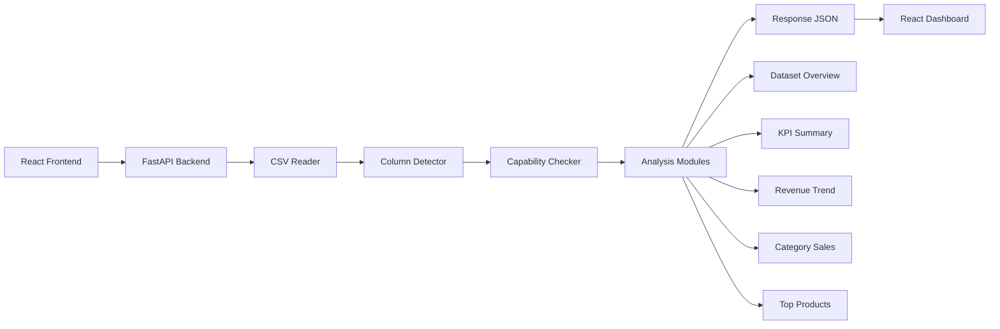

# Business Insight Hub Architecture V1

## 1. Project Overview

Business Insight Hub is an AI + Data + BI platform prototype. Users upload CSV files and receive dashboard-style business insights, including dataset health, KPI cards, revenue trends, category sales, and top product performance.

The current V1 system focuses on proving the core product loop: upload data, analyze it safely in the backend, and render useful business intelligence in the frontend.

## 2. V1 Scope

### Included

- CSV upload
- Dataset overview
- KPI summary
- Revenue trend
- Category sales
- Top products
- AI summary placeholder

### Out of Scope

- Login
- Database
- History
- Workflow
- Email automation

## 3. System Architecture Diagram



## 4. Data Flow

1. User uploads a CSV file from the React dashboard.
2. Frontend sends the file to `POST /api/analyze-csv` as `multipart/form-data`.
3. Backend reads the CSV using pandas.
4. System detects available CSV columns.
5. Capability checker determines which analysis modules are available and which should be skipped.
6. Analysis modules calculate metrics from valid rows and available columns.
7. Backend returns structured JSON with results and skipped-module reasons.
8. Frontend updates dashboard cards and charts from the response.

## 5. Backend Structure

The backend is a FastAPI application located in `backend/`.

- `api/`: HTTP route definitions, including `POST /api/analyze-csv`.
- `services/`: shared backend services such as CSV reading, column detection, and capability checking.
- `analysis_modules/`: modular business analysis functions for dataset overview, KPI summary, revenue trend, category sales, and top products.
- `schemas/`: Pydantic response models that define the API contract.
- `sample_data/`: primary realistic e-commerce CSV sample.
- `test_data/`: generated CSV files for upload and edge-case testing.
- `tools/`: utility scripts, including the automated test dataset generator.

## 6. Frontend Structure

The frontend is a React + Vite + Tailwind CSS prototype.

Current responsibilities:

- CSV file selection and upload
- Dashboard rendering
- Loading state while analysis runs
- Friendly error state when upload or analysis fails
- Fallback UI when modules are unavailable
- Presentation of KPI cards, revenue trend, category sales, and top products

The frontend focuses on display and interaction. Business calculations stay in the backend.

## 7. API Contract

### `POST /api/analyze-csv`

Input:

- `multipart/form-data`
- CSV file field: `file`

Output:

- `filename`
- `columns`
- `total_rows`
- `available_modules`
- `skipped_modules`
- `dataset_overview`
- `kpi_summary`
- `revenue_trend`
- `category_sales`
- `top_products`

Example response shape:

```json
{
  "filename": "ecommerce_sales.csv",
  "columns": ["order_id", "customer_id", "order_date", "product_name", "category", "quantity", "unit_price", "revenue"],
  "total_rows": 12540,
  "available_modules": ["dataset_overview", "revenue_trend", "category_sales", "top_products", "aov", "repeat_customer"],
  "skipped_modules": [],
  "dataset_overview": {
    "total_rows": 12540,
    "total_columns": 8,
    "column_names": ["order_id", "customer_id", "order_date", "product_name", "category", "quantity", "unit_price", "revenue"],
    "missing_values_total": 0,
    "missing_values_rate": 0.0,
    "duplicate_rows": 0,
    "date_range": {
      "start_date": "2023-01-01",
      "end_date": "2024-12-31"
    }
  },
  "kpi_summary": {
    "total_revenue": 1471326.45,
    "total_orders": 12540,
    "unique_customers": 1000,
    "average_order_value": 117.33
  },
  "revenue_trend": [
    {
      "month": "2023-01",
      "revenue": 58478.26
    }
  ],
  "category_sales": [
    {
      "category": "Electronics",
      "revenue": 727369.43,
      "percentage": 49.4
    }
  ],
  "top_products": [
    {
      "product_name": "Wireless Headphones",
      "revenue": 138601.02
    }
  ]
}
```

## 8. Design Principles

- Business logic stays in the backend.
- Frontend focuses on presentation and user interaction.
- Analysis is module-based and easy to extend.
- Missing columns should degrade gracefully instead of crashing.
- V1 avoids over-engineering: no database, login, or workflow engine yet.
- Prototype > Perfect.

## 9. Current Sprint Status

### Completed

- Project setup
- UI prototype
- Backend foundation
- Capability checker
- Dataset overview
- Revenue trend
- Category sales
- Top products
- KPI summary
- Test dataset generator

### Remaining

- AI Business Summary
- Final polish

## 10. Portfolio Value

This architecture is valuable because it demonstrates product thinking and practical engineering judgment.

It shows:

- A clear backend/frontend separation
- Modular data analysis design
- A realistic CSV upload and analysis flow
- Graceful handling of incomplete datasets
- Realistic generated test data for validation
- An extensible foundation for future AI summaries and workflow features

For portfolio or vocational training notes, this project communicates both technical capability and business-product awareness.
